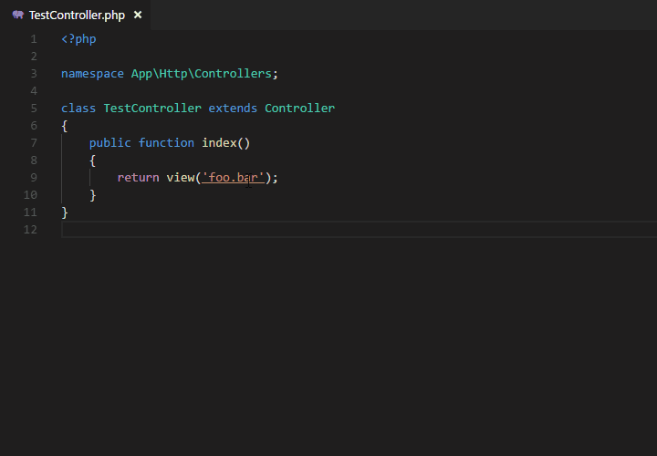

# Symfony goto view

Forked from Laravel go to view

# How to use



# Settings

## regex

Custom regex for matching file name strings. The strings will be searched for in the `symfony_goto_view.folders`.

## maxLinesCount

Maximum number of scanning rows. This is the maximum lines that should be scanned per file (document). In other words, the maximum lines in the code.

Default: 750

## folders

These are the folders that must be scanned to find a matching filename to link to.

```json
"symfony_goto_view.folders": {
    "default" : "/templates",
}
```

## extensions

Search views according to the configured extensions.

```json
"symfony_goto_view.extensions": [
    ".html.twig",
    ".inky.php"
]
```

## quickJump

Use `Ctrl` or `Alt` + `click` to jump to the first matched file.

> Mac or Windows, It depends on your configuration

## folderTip

Display the path name of the configuration.


#Installation Instructions

1. Install packages with `npm install` 
2. Install by running `npm install typescript`
3. Install vsce by running `npm install -g @vscode/vsce`
4. Compile package `vsce package`
5. Install package `code --install-extension ./symfony-goto-view-1.0.0.vsix`
 